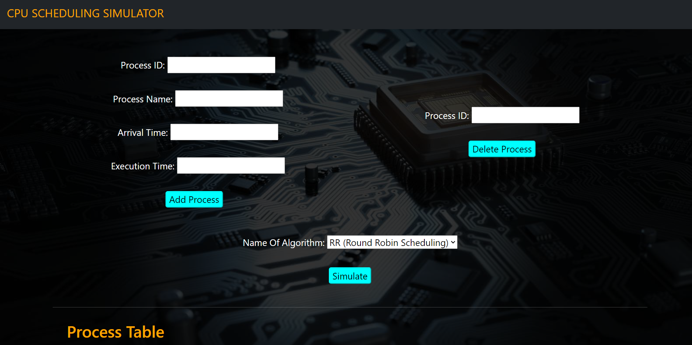

# OS Lab Project

A web based application which "simulates" 4 types of CPU/Process scheduling algorithms in the backend and returns the result to the client.

The algorithms implemented are:

- `FCFS` (First Come First Serve)
- `SJF Preemptive` (Shortest Job First)
- `SJF Non Preemptive`
- `RR` (Round-Robin Scheduling)

### How it looks?

### Tech Stack

- `Express JS`: For REST API endpoints
- `Node JS`: For server
- `PostgreSQL`: For database storage
- `Vanilla JS and Bootstrap`: For frontend